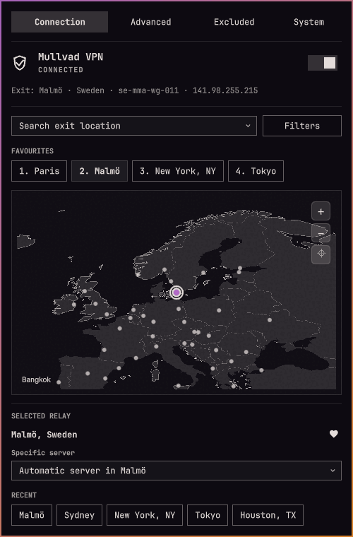

# Mullvad VPN



Mullvad VPN controls for the Omarchy Quattro bar.

- Connect and disconnect from the bar or panel
- Search relays and choose a specific server
- Save up to nine favourite locations
- Filter by provider, ownership, and IP version
- Configure DNS, anti-censorship, LAN sharing, and lockdown mode
- Discover installed applications and launch them outside the VPN
- Group related excluded processes by launched application
- Explore eligible Mullvad relay cities on an offline, zoomable world map
- Inspect bounded, read-only CLI, daemon, package, and update-check diagnostics

The plugin supports the Omarchy 4.0.3+ stock bar. Replacement bars that do not expose its scoped service show unavailable controls rather than attempting access to host internals.

## Install

```bash
omarchy plugin add https://github.com/HalmyLyseas/omarchy-mullvad-vpn.git --enable
```

This plugin targets Mullvad VPN 2026.4. Install and enable Mullvad VPN separately before using the controls.

## Upgrading from an earlier identity

The plugin ID is now `halmylyseas.mullvad-vpn`. Installations under the earlier fork IDs `halmylyseas.omarchy-mullvad` and `halmylyseas.oma-mullvad`, or the upstream ID `io.github.kallupx.oma-mullvad`, do not migrate automatically. Back up `~/.config/omarchy/shell.json` before switching, preserve the old widget's favourites, recent items and refresh interval, and disable the old widget before enabling this one. Update custom IPC keybindings to the new ID.

## Controls

- Left-click: open the panel
- Right-click: connect or disconnect
- Middle-click: refresh

The panel has Main, Advanced, Excluded, and System tabs. It is keyboard-accessible (1–4 select tabs). Main and System remain available when the Mullvad CLI or daemon is unavailable. Account controls on System require a working CLI and daemon; its package and update diagnostics remain read-only.

On Main, search for an exit city or select an eligible marker on the map. Favourites and recent cities are one-click choices; selecting a city connects or reconnects as needed. The selected relay card lets you save a favourite or choose a specific server. Relay filters are behind the Filters button. Scroll over the map to zoom, drag to pan, and use its controls to zoom or reset. Choosing a city moves the map there with a brief zoom-out, pan, and zoom-in animation. The map stays offline and limits zoom to regional detail. Connection policy is on Advanced; account login and logout are on System.

## Known limitations

Tailscale's netfilter rules can interfere with Mullvad's Linux split-tunnelling marks. On affected systems, including the combination of Tailscale 1.102.3 and Mullvad 2026.4, an application appears in the excluded-process list but public connections time out. This is tracked upstream in [tailscale/tailscale#19787](https://github.com/tailscale/tailscale/issues/19787).

Do not disable Tailscale netfilter without providing equivalent firewall and tailnet-routing rules. The plugin does not alter Tailscale or system firewall configuration.

## Hotkeys

The plugin does not add keybindings automatically. Example `~/.config/hypr/bindings.lua` entries:

```lua
o.bind("SUPER + SHIFT + V", "Toggle Mullvad", "omarchy-shell halmylyseas.mullvad-vpn toggleTunnel")
o.bind("SUPER + ALT + V", "Next Mullvad favourite", "omarchy-shell halmylyseas.mullvad-vpn nextFavorite")
o.bind("SUPER + SHIFT + ALT + V", "Mullvad VPN panel", "omarchy-shell halmylyseas.mullvad-vpn toggle")
```

## Uninstall

```bash
omarchy plugin remove halmylyseas.mullvad-vpn
```

## Privacy

Account numbers are sent to `mullvad account login` over standard input and are never stored. This plugin stores only favourite locations, recent locations, and recent excluded desktop IDs. Mullvad remains responsible for VPN settings.

## Verify

Run the complete non-disruptive local gate:

```bash
bash tests/ci-local
```

Use `bash tests/ci-local --no-cage` only as a fallback for an existing live session when Cage cannot be used.

The CLI contract and every VPN-changing operation run against inert test-local mocks; automated suites never invoke the live Mullvad CLI.

## License

Maintained by [HalmyLyseas](https://github.com/HalmyLyseas), based on [kallupx/oma-mullvad](https://github.com/kallupx/oma-mullvad).

MIT © 2026 kallupx. Original copyright and license are retained.

The map uses public-domain [Natural Earth 1:50m land](https://www.naturalearthdata.com/downloads/50m-physical-vectors/) and [country boundaries](https://www.naturalearthdata.com/downloads/50m-cultural-vectors/) bundled with the plugin. Relay locations come from the Mullvad CLI.
