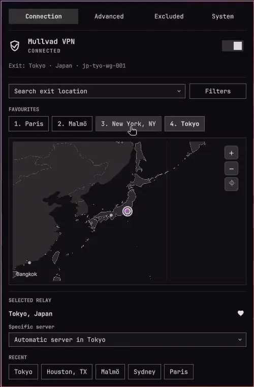

# Mullvad VPN

## Preview

| Connection panel | Animated map movement |
| --- | --- |
|  |  |

[Static panel preview](preview.png)

Mullvad VPN controls for the Omarchy Quattro bar.

- Connect and disconnect from the bar or panel
- Search relays and choose a specific server
- Save up to nine favourite locations
- Filter by provider, ownership, and IP version
- Configure DNS, anti-censorship, LAN sharing, and lockdown mode
- Discover installed applications and launch them outside the VPN
- Group related excluded processes by launched application
- Explore eligible Mullvad relay cities on an offline, zoomable world map
- Inspect bounded, read-only CLI, daemon, package, and update-check diagnostics

The plugin targets the Omarchy 4.0.4 stock bar. Replacement bars that do not expose its scoped service show unavailable controls rather than attempting access to host internals.

## Install

```bash
omarchy plugin add https://github.com/HalmyLyseas/omarchy-mullvad-vpn.git --enable
```

The plugin has been validated with the Mullvad VPN 2026.4 CLI. Other versions are not blocked; the panel warns when a CLI version is untested. Install and enable Mullvad VPN separately before using the controls.

## Controls

- Left-click: open the panel
- Right-click: connect or disconnect while logged in
- Middle-click: refresh

The panel has Connection, Advanced, Excluded, and System tabs. It is keyboard-accessible (1–4 select tabs). When the CLI or daemon is unavailable, Connection and System remain available for status and diagnostics. A confirmed logout limits the panel to System; log in there to unlock the other tabs. If a tunnel is still active, System offers a Disconnect button. Account controls require a working CLI and daemon. Package diagnostics are read-only, and the update check does not install updates.

On Connection, search for an exit city or select an eligible marker on the map. Favourites and recent cities are one-click choices; selecting a city connects or reconnects as needed. The selected relay card lets you save a favourite or choose a specific server. Relay filters are behind the Filters button. The panel grows to fit Connection's default content when screen space allows; expanded filters and shorter screens can still scroll. Scroll over the map to zoom, drag to pan, and use its controls to zoom or reset. Choosing a city moves the map there with a brief zoom-out, pan, and zoom-in animation. The map stays offline and limits zoom to regional detail. Connection policy and a compact two-column DNS blocking grid are on Advanced; account login and logout are on System.

## Known limitations

Tailscale's netfilter rules can interfere with Mullvad's Linux packet marks used for split tunnelling. If excluded applications appear in the list but their connections time out, check the local firewall rules and the related [Tailscale packet-mark issue](https://github.com/tailscale/tailscale/issues/19787). The issue reports a conflict beginning with Tailscale 1.98.x; it does not establish a Mullvad CLI version requirement.

Do not disable Tailscale netfilter without providing equivalent firewall and tailnet-routing rules. The plugin does not alter Tailscale or system firewall configuration.

## Uninstall

```bash
omarchy plugin remove halmylyseas.mullvad-vpn
```

## Privacy

Account numbers are sent to `mullvad account login` over standard input and are never stored. This plugin stores only favourite locations, recent locations, and recent excluded desktop IDs. Mullvad remains responsible for VPN settings.

## Verify

Run the complete non-disruptive local gate:

```bash
bash tests/ci-local
```

Use `bash tests/ci-local --no-cage` only as a fallback for an existing live session when Cage cannot be used.

The CLI contract and every VPN-changing operation run against inert test-local mocks; automated suites never invoke the live Mullvad CLI.

## License

Maintained by [HalmyLyseas](https://github.com/HalmyLyseas), based on [kallupx/oma-mullvad](https://github.com/kallupx/oma-mullvad).

MIT © 2026 kallupx. Original copyright and license are retained.

The map uses public-domain [Natural Earth 1:50m land](https://www.naturalearthdata.com/downloads/50m-physical-vectors/) and [country boundaries](https://www.naturalearthdata.com/downloads/50m-cultural-vectors/) bundled with the plugin. Relay locations come from the Mullvad CLI.
